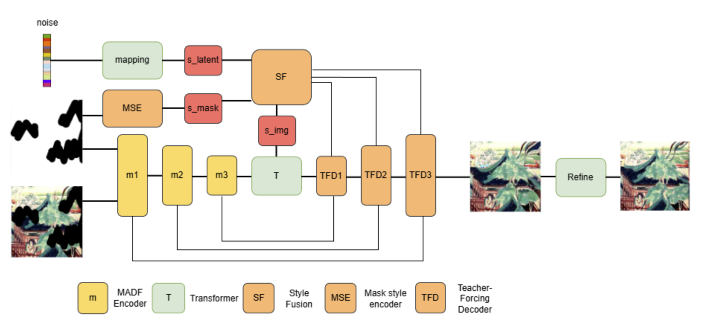

# HMAT: Hybrid Mask-Aware Transformer for Mural Restoration

High-fidelity restoration of ancient murals: reconstruct damaged regions
(cracks + paint peeling) while preserving every authentic pixel bit-exactly.
HMAT combines MADF-style mask-aware dynamic convolutions for local texture, a
Swin transformer bottleneck with validity-masked attention for global
structure, mask-conditional style fusion, and a teacher-forcing decoder with
hard-gated skips. Built on the [MAT (CVPR'22)](https://github.com/fenglinglwb/MAT)
/ StyleGAN2-ADA codebase.



## Results

DHMural-style benchmark: 10,584 training / 2,649 test mural images at 256x256,
fixed seeded test masks (mixed crack+peel, 20-30% damage), full-image metrics.
All baselines self-trained on identical data and masks; one shared metric
implementation (`benchmark/scripts/eval_outputs.py`).

| Model | PSNR ↑ | SSIM ↑ | L1 ↓ | FID ↓ |
|---|---|---|---|---|
| LaMa-fourier (best ckpt) | 25.30 | 0.898 | 0.0193 | 17.77 |
| HMAT (kimg 572, old recipe) | 24.24 | 0.892 | 0.0216 | 15.25 |
| HMAT v2 (training recipe below, in progress) | 24.65+ | 0.893 | 0.0206 | **15.30** |

HMAT leads on perceptual realism (FID, P-IDS/U-IDS); the v2 recipe is closing
the pixel-fidelity gap. Full numbers: `benchmark/results/test_metrics.csv`.

## Environment

```bash
conda env create   # python 3.7, torch 1.7.1+cu110, see MAT upstream requirements
pip install -r requirements.txt
```

The HRF perceptual loss needs the ADE20k ResNet50-dilated encoder weights:

```bash
mkdir -p <TORCH_HOME>/ade20k/ade20k-resnet50dilated-ppm_deepsup
wget -O <TORCH_HOME>/ade20k/ade20k-resnet50dilated-ppm_deepsup/encoder_epoch_20.pth \
  http://sceneparsing.csail.mit.edu/model/pytorch/ade20k-resnet50dilated-ppm_deepsup/encoder_epoch_20.pth
```

and set `WEIGHTS_PATH` in `losses/resnet_pl.py` accordingly.

## Training (v2 recipe)

```bash
python train.py \
  --outdir=outputs --data=<train_dir> --data_val=<test_dir> \
  --dataloader=datasets.dataset_256.ImageFolderMaskDataset \
  --metrics=fid2649_full,psnr2649_full \
  --gpus=1 --batch=16 --batch-gpu=4 --kimg=1000 --snap=10 \
  --cfg=places256 --aug=noaug --workers=2 \
  --style_mix=0.0 --pr=0.0 --glr=0.001 --dlr=0.0001 --gamma=2.0 \
  --wandb-project=mural_inpainting
```

Objective: non-saturating adversarial (two heads) + hole-normalized L1 (w=10,
final and stage-1) + discriminator feature-matching (w=10) + high-receptive-
field ADE20k perceptual loss (w=10). TTUR (G 1e-3 / D 1e-4), R1 gamma 2,
style mixing off. Fits one RTX 3090 (24 GB) — the MADF dynamic convolution is
reparametrized as 16+1 basis convolutions (exact identity), enabling
batch-gpu 4 at ~200 s/kimg.

## Evaluation

Generate fixed test masks + run a snapshot on them + compute metrics:

```bash
python benchmark/scripts/prepare_dataset.py        # 256px data + seeded masks
python benchmark/scripts/hmat_predict_fixed.py <snapshot.pkl> <out_dir>
python benchmark/scripts/eval_outputs.py <out_dir> <gt_dir> <model_name>
```

Metrics: PSNR / SSIM / L1 (cv2 implementations), FID / P-IDS / U-IDS
(NVIDIA inception-2015-12-05). In-training validation is deterministic
(const noise, seeded z, per-image-seeded masks, full 2,649 images).

## Repository layout

- `networks/mat.py` — HMAT generator (MADF encoder, masked Swin bottleneck,
  style fusion, teacher-forcing decoder) + two-head discriminator
- `networks/non*.py`, `networks/Equal_Capacity.py`, `networks/Heavy_Semantic_Bias.py` — ablation variants
- `losses/loss.py` — two-stage objective; `losses/resnet_pl.py` — HRF perceptual
- `models_ade20k/` — vendored ADE20k encoder (for the HRF loss)
- `datasets/mask_generator_256.py` — mural damage masks (crack / peel / mixed)
- `benchmark/` — comparison protocol: docs (code review, SOTA analysis,
  LaMa training protocol), scripts (fixed-mask benchmark pipeline), LaMa
  configs used for the baseline, and the results table

## Changelog (2026-06)

- Token-validity mask for the masked attention now derives from the real hole
  mask (was thresholded learned features); all-masked windows fall back to
  content-based attention.
- L1 reconstruction loss actually enters the objective (hole-normalized, plus
  a stage-1 term); added discriminator feature matching and the HRF perceptual
  loss; VGG19 perceptual removed.
- Deterministic evaluation (const noise, seeded z and masks, full test set).
- MADF reparametrized as basis convolutions: exact same function, ~3.7x faster
  training, real batches on a single 24 GB GPU.
- TTUR, R1 gamma 2, style mixing disabled; gradient accumulation via
  `--batch-gpu`.
